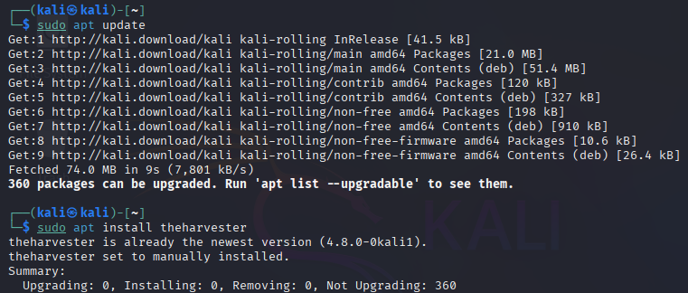
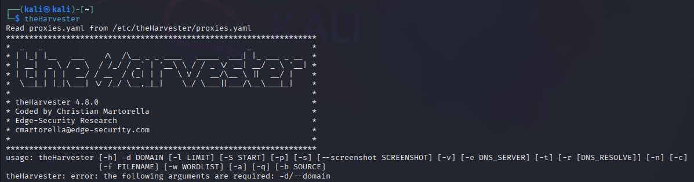
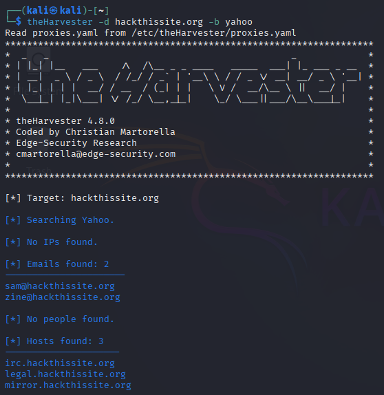
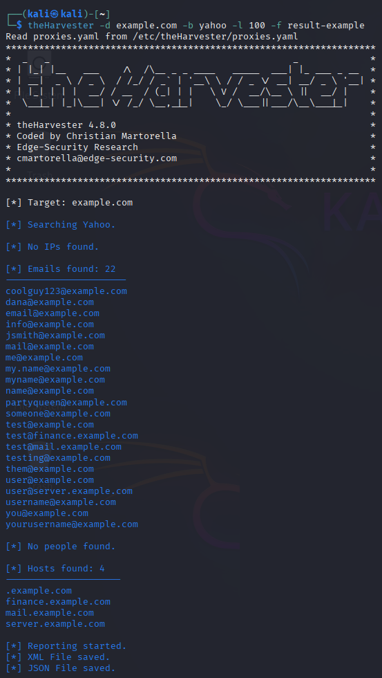
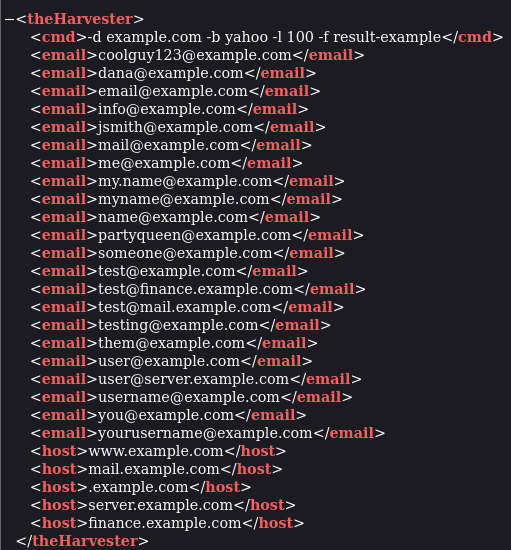

# theHarvester - OSINT Tool تطبيقاتي العملية لأداة

This section provides a complete walkthrough on how to use theHarvester — a powerful OSINT (Open Source Intelligence) tool used for gathering publicly available information about a target.

---

## 🔍 What is theHarvester?

theHarvester is an open-source intelligence tool designed to help gather emails, subdomains, IPs, and usernames from different public sources like search engines and websites such as:

- Google
- Bing
- Yahoo
- Shodan
- LinkedIn
- Baidu
- And more...

---

1. Installing theHarvester (if not already installed) In Kali Linux, the tool is usually pre-installed. But if it’s not, run:
```
sudo apt update
sudo apt install theharvester
```



---

2. Running the Tool: This will show the help menu with all available options.

```
theHarvester
```

---

3. Basic Command Syntax
```
theHarvester -d [domain] -b [data source]
```
-d: The target domain.

-b: The data source (e.g., google, bing, yahoo, baidu, shodan, linkedin).

Example

```
theHarvester -d hackthissite.org -b google
```
(Requires API Key)

Instead we can use Yahoo which doesn't require API Key




---

4. Detailed Command
```
theHarvester -d example.com -b yahoo -l 100 -f result-example
```
| Option | Description                                                      |
| ------ | ---------------------------------------------------------------- |
| `-d`   | Target domain name.                                              |
| `-b`   | Data source to use (e.g., google, bing, shodan, linkedin, etc.). |
| `-l`   | Limit the number of results to fetch.                            |
| `-f`   | Save the output to an HTML or XML file.                          |
| `-v`   | Verbose output (detailed display).                               |
| `-h`   | Show the help message.                                           |



---

5. View saved information in result-example.XML or JSON 


---

6. Result Analysis
After scanning, you will typically get:

Email addresses

Subdomains

Hostnames

Possibly IPs

Shodan/LinkedIn data (if API is configured)


